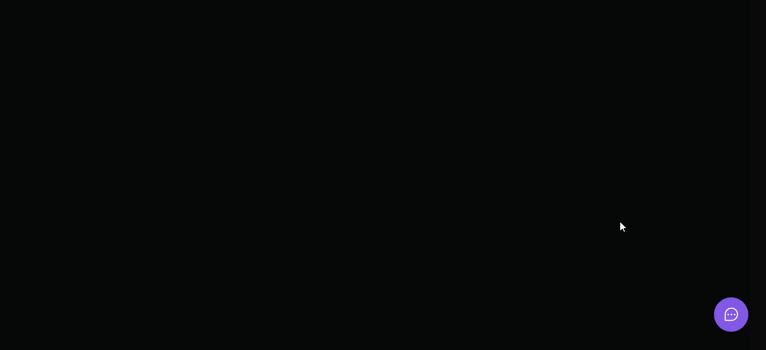

# NLW Return - Widget

##  

The project was to develop a widget for the user to send an idea, comment or bug feedback and allow an automatic screen print.

## 🚀 Result: 

<a href="https://feedget-widget-qovw0fw4w-eurenatolima.vercel.app/">Clique aqui para acessar o projeto</a> 

## 💻 Technologies that were used:
* TypeScript
* Tailwind CSS
* React
